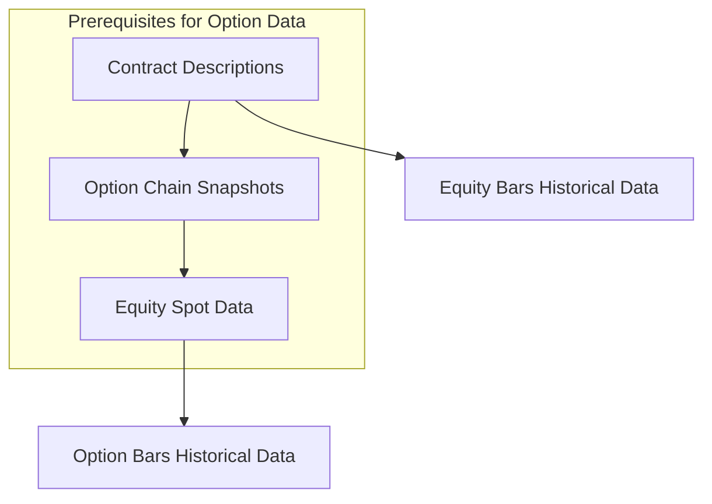

# Trading Data Flow Architecture & Dependencies

## Executive Summary

This document defines the critical data flow architecture, dependencies, and operational constraints for the trading data pipeline. **Option data requires strict dependency management**: contracts → chains → spot prices → option bars. TWS API provides snapshot-only option chains, not historical data.

## Critical Dependencies & Constraints

### 🔒 **Hard Dependencies** (Must be satisfied before next step)



1. **Contracts First**: Contract descriptions must exist before requesting any derivative data
2. **Chains Required**: Option chain snapshots are mandatory before option bar data
3. **Spot Price Needed**: Current equity price required for strike selection
4. **No Historical Chains**: TWS API only provides current option chain snapshots

### 🚫 **Critical Constraints**

- **DO NOT** request option bars without contract descriptions
- **DO NOT** request option bars without option chain snapshots  
- **DO NOT** request option bars without current spot price
- **DO NOT** assume historical option chains are available from TWS API

## Data Types & Characteristics

### Historical Data (Backfillable)
- ✅ **Equity Bars**: Full historical data available via TWS API
- ✅ **Option Bars**: Historical data available for specific contracts
- ❌ **Option Chains**: NOT historically available - snapshots only

### Live/Current Data (Real-time snapshots)
- ✅ **Option Chains**: Current snapshot only via `reqSecDefOptParams` or `reqContractDetails`
- ✅ **Market Data**: Live quotes, Greeks, implied volatility
- ✅ **Contract Descriptions**: Current contract definitions

## Use Cases & Process Classification

### 1. **Initial Market Setup** (Cold Start)
**Objective**: Establish baseline market data for new symbols

**Prerequisites**: None
**Process**: Sequential dependency execution
**Frequency**: One-time per symbol

```python
# Sequence MUST be followed
workflow = [
    "backfill_contracts_us_rt",      # Get contract descriptions
    "contracts_snapshot",            # Get current option chain  
    "backfill_equity_bars",          # Get equity price history
    "backfill_option_bars"           # Get option history (uses all above)
]
```

**Critical Points**:
- Contract data must be available before any options processing
- Option chain snapshot provides current strikes/expiries
- Equity data needed for ATM strike selection
- Option bars can only be requested after all prerequisites

### 2. **Daily Market Update** (Warm Start)  
**Objective**: Update existing data with latest information

**Prerequisites**: All baseline data exists
**Process**: Incremental updates with validation
**Frequency**: Daily during market hours

```python
# Validation before processing
def daily_update(symbol: str):
    validate_prerequisites(symbol)  # Ensure all deps exist
    
    # Update in dependency order
    refresh_option_chain_snapshot(symbol)
    update_equity_bars(symbol, last_available_date)
    update_option_bars(symbol, validated_contracts_only)
```

### 3. **Live Trading Data** (Real-time)
**Objective**: Real-time market data for active trading

**Prerequisites**: All historical data current
**Process**: Streaming data with persistence
**Frequency**: Continuous during market hours

**Data Streams**:
- Live option chain updates (snapshots every N minutes)
- Real-time equity prices
- Live option quotes for active positions
- Greeks and implied volatility updates

### 4. **Research & Backtesting** (Read-only)
**Objective**: Historical analysis and strategy development

**Prerequisites**: Complete historical datasets
**Process**: Query-only operations
**Frequency**: As needed

**Capabilities**:
- Historical option pricing analysis
- Volatility surface reconstruction
- Greeks calculations from historical data
- Strategy backtesting with realistic option data

## Persistence Strategy

### ✅ **Smart Persistence Rules**

1. **Request Once, Store Forever**: Any data requested from TWS API must be persisted
2. **Check Before Request**: Always verify data doesn't exist before API calls
3. **Incremental Updates**: Only request missing date ranges
4. **Metadata Tracking**: Store request metadata to avoid redundant calls

```python
def smart_backfill(symbol: str, start: date, end: date) -> None:
    """Only backfill missing data ranges."""
    repo = EquityBarRepository()
    
    # Check what we already have
    present_dates = repo.present_dates(symbol, "1 day", start, end)
    missing_windows = calculate_missing_windows(present_dates, start, end)
    
    # Only request missing data
    for window_start, window_end in missing_windows:
        data = api_client.get_equity_bars(symbol, window_start, window_end)
        repo.save(data, symbol=symbol, bar_size="1 day")
```

### 🔄 **Update Frequency Guidelines**

| Data Type | Update Frequency | Rationale |
|-----------|-----------------|-----------|
| Contract Descriptions | Weekly | Rarely change |
| Option Chains | Every 4 hours during market | Strike/expiry availability changes |
| Equity Bars | End of day | Historical data is final |
| Option Bars | End of day | Historical data is final |
| Live Quotes | Real-time | Trading decisions |

## Process Orchestration

### Job Dependencies & Execution Order

```python
# jobs/orchestrator.py - Proper dependency management
class DataPipelineOrchestrator:
    def setup_new_symbol(self, symbol: str) -> None:
        """Cold start for new symbol - MUST follow dependency order."""
        
        # Step 1: Contract descriptions (Foundation)
        if not self.contracts_exist(symbol):
            self.run_job("backfill_contracts_us_rt", symbol=symbol)
        
        # Step 2: Option chain snapshot (Required for option work)  
        if not self.option_chain_current(symbol):
            self.run_job("contracts_snapshot", symbol=symbol)
        
        # Step 3: Equity bars (Required for spot price)
        if not self.equity_data_complete(symbol):
            self.run_job("backfill_equity_bars", symbol=symbol)
            
        # Step 4: Option bars (Requires all above)
        if self.all_prerequisites_met(symbol):
            self.run_job("backfill_option_bars", symbol=symbol)
    
    def daily_update(self, symbol: str) -> None:
        """Incremental updates - validate before processing."""
        
        # Validate prerequisites still exist
        self.validate_data_integrity(symbol)
        
        # Refresh option chain (snapshot only)
        self.run_job("contracts_snapshot", symbol=symbol) 
        
        # Update historical data (incremental)
        self.run_job("backfill_equity_bars", symbol=symbol, incremental=True)
        self.run_job("backfill_option_bars", symbol=symbol, incremental=True)
```

### Validation Framework

```python
# jobs/validation.py - Pre-flight checks
class DataValidation:
    
    def validate_option_backfill_prerequisites(self, symbol: str) -> None:
        """Validate all prerequisites before option data requests."""
        
        # Check contract descriptions
        if not self.contract_repo.has_symbol(symbol):
            raise PrerequisiteError(f"No contract descriptions for {symbol}")
        
        # Check option chain snapshot  
        if not self.chain_repo.has_recent_snapshot(symbol, max_age_hours=24):
            raise PrerequisiteError(f"No recent option chain snapshot for {symbol}")
        
        # Check spot price availability
        if not self.equity_repo.has_recent_data(symbol, max_age_days=1):
            raise PrerequisiteError(f"No recent equity data for spot price - {symbol}")
    
    def validate_data_integrity(self, symbol: str) -> None:
        """Validate data consistency across repositories."""
        
        # Ensure option data has corresponding equity data
        option_dates = self.option_repo.present_dates(symbol)
        equity_dates = self.equity_repo.present_dates(symbol)
        
        missing_equity = option_dates - equity_dates
        if missing_equity:
            raise IntegrityError(f"Option data exists without equity data: {missing_equity}")
```

## Live vs Historical Data Processes

### Historical Data Pipeline (Batch Processing)
- **Purpose**: Backfill historical data for analysis
- **API Calls**: `reqHistoricalData`
- **Frequency**: Run once, then incremental updates
- **Data Types**: Equity bars, option bars (for known contracts)

### Live Data Pipeline (Streaming Processing)  
- **Purpose**: Real-time market data for trading
- **API Calls**: `reqMktData`, `reqSecDefOptParams`
- **Frequency**: Continuous during market hours
- **Data Types**: Live quotes, option chains, Greeks

### Snapshot Data Pipeline (Scheduled Processing)
- **Purpose**: Current market structure (chains, contracts)
- **API Calls**: `reqSecDefOptParams`, `reqContractDetails`
- **Frequency**: Multiple times per day
- **Data Types**: Option chain snapshots, contract updates

## Implementation Guidelines

### ❌ **Anti-Patterns to Avoid**

```python
# DON'T: Request option data without prerequisites
def bad_option_backfill(symbol: str):
    # This will FAIL - no contract info, no chain, no spot price
    return api_client.get_option_bars(symbol, start_date, end_date)

# DON'T: Assume historical option chains exist
def bad_historical_chain(symbol: str, historical_date: date):
    # This will FAIL - TWS API doesn't provide historical chains
    return api_client.get_option_chain(symbol, historical_date)

# DON'T: Request already persisted data
def bad_redundant_request(symbol: str):
    # Always check first!
    return api_client.get_equity_bars(symbol, "2020-01-01", "2020-12-31")
```

### ✅ **Correct Patterns**

```python
# DO: Validate prerequisites before option requests
def good_option_backfill(symbol: str):
    validator = DataValidation()
    validator.validate_option_backfill_prerequisites(symbol)
    
    # Get current chain for strike selection
    chain = chain_repo.load_latest_snapshot(symbol)
    spot_price = equity_repo.get_latest_close(symbol)
    
    # Select contracts based on current market structure
    contracts = select_option_contracts(chain, spot_price)
    
    # Request only selected contracts
    return backfill_option_bars(contracts, start_date, end_date)

# DO: Check persistence before API calls
def good_incremental_backfill(symbol: str, start: date, end: date):
    repo = EquityBarRepository()
    present_dates = repo.present_dates(symbol, "1 day", start, end)
    
    missing_windows = calculate_missing_windows(present_dates, start, end)
    if not missing_windows:
        return  # Nothing to do - data already exists
    
    for window_start, window_end in missing_windows:
        data = api_client.get_equity_bars(symbol, window_start, window_end)
        repo.save(data, symbol=symbol, bar_size="1 day")
```

## Error Handling & Recovery

### Dependency Failures
```python
class PrerequisiteError(Exception):
    """Raised when required data dependencies are missing."""
    pass

def handle_option_backfill_error(symbol: str, error: Exception):
    if isinstance(error, PrerequisiteError):
        logger.error(f"Prerequisites missing for {symbol}: {error}")
        # Attempt to fulfill prerequisites
        setup_prerequisites(symbol)
    else:
        logger.error(f"Option backfill failed for {symbol}: {error}")
        # Schedule retry or manual intervention
```

### Data Integrity Issues
```python
def recover_from_integrity_error(symbol: str):
    """Recover from data inconsistencies."""
    
    # Option 1: Re-sync from authoritative source
    resync_equity_data(symbol)
    
    # Option 2: Remove inconsistent option data
    if not can_validate_option_data(symbol):
        remove_orphaned_option_data(symbol)
        schedule_option_rebackfill(symbol)
```

## Monitoring & Alerting

### Key Metrics to Track
- **Dependency Violations**: Attempts to request option data without prerequisites
- **API Rate Limiting**: TWS API throttling on contract details requests  
- **Data Freshness**: Age of option chain snapshots
- **Missing Data Windows**: Gaps in historical data coverage

### Critical Alerts
```python
# Alert when prerequisites are violated
def alert_prerequisite_violation(symbol: str, missing_deps: list):
    message = f"CRITICAL: Option data request attempted without prerequisites for {symbol}. Missing: {missing_deps}"
    send_alert(message, severity="CRITICAL")

# Alert when option chains are stale  
def alert_stale_option_chains(symbol: str, age_hours: int):
    if age_hours > 24:
        message = f"WARNING: Option chain snapshot for {symbol} is {age_hours} hours old"
        send_alert(message, severity="WARNING")
```

This architecture ensures data consistency, prevents API abuse, and maintains the critical dependencies required for accurate option pricing and analysis.