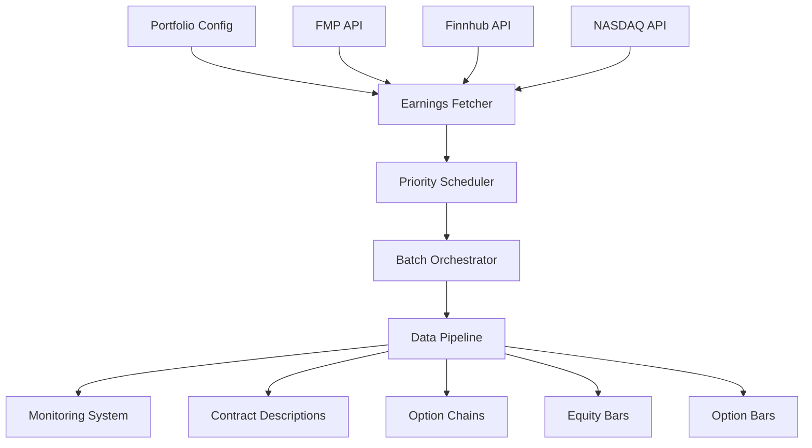

# Comprehensive Daily Update System

## Overview

This system solves the problem of managing daily data updates for a large portfolio of trading symbols with earnings-driven prioritization. Instead of manually checking earnings in TradingView, the system automatically fetches earnings data from multiple sources and prioritizes updates accordingly.

## 🎯 Problem Solved

**Before**: Manual earnings checking in TradingView → Manual priority decisions → Single-ticker job scripts
**After**: Automated earnings detection → Smart priority scheduling → Comprehensive daily updates

## 🏗️ Architecture



## 📦 Key Components

### 1. Multi-Source Earnings Fetcher
- **Primary**: Financial Modeling Prep (250 free calls/day)
- **Secondary**: Finnhub (60 free calls/minute)
- **Fallback**: NASDAQ API + Yahoo scraping
- **Smart caching** prevents redundant API calls

### 2. Priority-Based Scheduler
- 🔥 **CRITICAL**: Earnings today/tomorrow (4-hour updates)
- ⚡ **HIGH**: Earnings this week (8-hour updates) 
- 📊 **MEDIUM**: Earnings next week (12-hour updates)
- 📅 **LOW**: No immediate earnings (daily updates)
- 🔧 **MAINTENANCE**: Background symbols (3-day updates)

### 3. Resource Optimization
- **Batch processing** for efficiency
- **Circuit breaker** protection for failed symbols
- **Dependency-aware** execution (contracts → chains → equity → options)
- **Smart persistence** (never re-request existing data)

## 🚀 Usage

### Basic Daily Update
```bash
# Updates entire portfolio with earnings prioritization
python jobs/run_daily_comprehensive.py
```

### Custom Configuration
```bash
# Use custom symbol portfolio
python jobs/run_daily_comprehensive.py --config config/my_portfolio.yaml
```

### Preview Mode
```bash
# See what would be updated without making changes
python jobs/run_daily_comprehensive.py --dry-run
```

### Earnings-Only Refresh
```bash
# Just refresh earnings priorities (no data updates)
python jobs/run_daily_comprehensive.py --refresh-priorities-only
```

## ⚙️ Configuration

### Portfolio Configuration (`config/portfolio.yaml`)
```yaml
portfolios:
  main:
    description: 'Main trading portfolio'
    symbols: [AAPL, GOOGL, MSFT, AMZN, TSLA]
    enabled: true
    
settings:
  max_daily_symbols: 150
  enable_earnings_priority: true
  circuit_breaker_enabled: true
```

### API Keys (Environment Variables)
```bash
export FMP_API_KEY="your_fmp_api_key"
export FINNHUB_API_KEY="your_finnhub_api_key"
```

## 📅 Automation

### Cron Schedule
```bash
# Daily update at 6 PM ET (after market close)
0 18 * * 1-5 cd /path/to/earnings_ibapi && python jobs/run_daily_comprehensive.py

# Priority refresh every 6 hours during market days
0 */6 * * 1-5 cd /path/to/earnings_ibapi && python jobs/run_daily_comprehensive.py --refresh-priorities-only

# Weekend maintenance
0 10 * * 6 cd /path/to/earnings_ibapi && python jobs/run_daily_comprehensive.py --dry-run
```

## 📊 Monitoring

### Real-Time Web Dashboard
```bash
# Start monitoring dashboard on port 8080
python monitoring/dashboard.py --port 8080
```

### Performance Reports
```bash
# Generate 7-day performance report
python monitoring/dashboard.py --report --days 7 --output reports/
```

## 🧪 Testing

### Demo Mode (No API Keys Required)
```bash
# Test with sample earnings data
python examples/test_comprehensive_system.py
```

### Status Check
```bash
# Get current system status
python jobs/run_daily_comprehensive.py --status-report
```

## 📈 Features

### ✅ Smart Features
- **Earnings Intelligence**: Auto-prioritizes by earnings proximity
- **Circuit Breaker Protection**: Prevents cascading failures
- **Smart Persistence**: Never re-requests existing data
- **Multi-Source Fallback**: Robust earnings data acquisition
- **Resource Optimization**: Efficient batch processing

### ✅ Monitoring & Reliability
- **Real-time performance tracking**
- **Alert system** for failures and anomalies
- **Historical analysis** and trending
- **Circuit breaker metrics**
- **Comprehensive logging**

### ✅ TWS API Compliance
- **Respects rate limits** with buffer margins
- **Proper dependency ordering** (contracts → chains → equity → options)
- **Smart caching** to minimize API usage
- **Circuit breaker protection** for API failures

## 🎯 Example Execution Flow

1. **Morning**: System fetches latest earnings calendar
2. **Priority Assignment**: 
   - AAPL (earnings tomorrow) → 🔥 CRITICAL priority
   - GOOGL (earnings next week) → ⚡ HIGH priority  
   - TSLA (no earnings) → 🔧 MAINTENANCE priority
3. **Batch Creation**: Groups symbols by priority for efficient processing
4. **Execution**: Updates data in priority order with circuit breaker protection
5. **Monitoring**: Tracks performance, logs results, generates alerts

## 🔧 Customization

### Adding New Portfolios
Edit `config/portfolio.yaml`:
```yaml
portfolios:
  my_custom_portfolio:
    description: 'Custom selection'
    symbols: [NVDA, AMD, INTC]
    enabled: true
```

### Adjusting Priorities
Modify priority thresholds in `earnings/scheduler.py`:
```python
def refresh_earnings_priorities(self, symbols: List[str]):
    # Customize these thresholds
    if days_until <= 1:
        priority = SchedulePriority.CRITICAL  # Tomorrow
    elif days_until <= 7:
        priority = SchedulePriority.HIGH      # This week
```

## 📋 Requirements

### Python Dependencies
```bash
pip install pandas requests pyyaml sqlite3
# Optional for web dashboard:
pip install flask plotly
```

### API Access (Free Tiers Available)
- **Financial Modeling Prep**: 250 calls/day free
- **Finnhub**: 60 calls/minute free
- **NASDAQ**: Public API (no key required)

## 🎉 Benefits

1. **Automated Earnings Intelligence**: No more manual TradingView checking
2. **Efficient Resource Usage**: Smart batching and caching
3. **Scalable**: Handles 150+ symbols daily with ease
4. **Reliable**: Circuit breaker protection and multi-source fallback
5. **Monitored**: Comprehensive performance tracking and alerting
6. **Flexible**: Easy portfolio management and customization

The system transforms manual, error-prone daily updates into an automated, intelligent, and reliable process that prioritizes based on real earnings events.